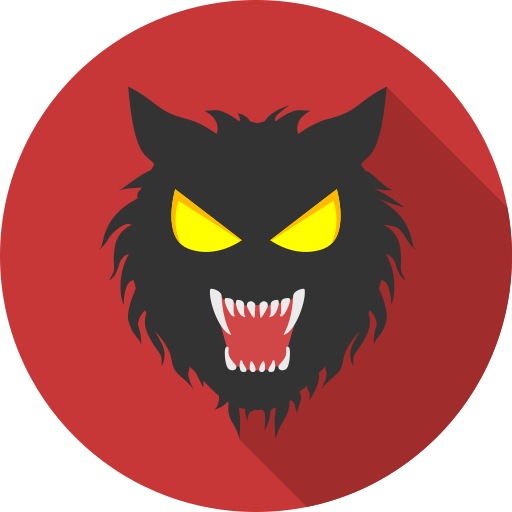
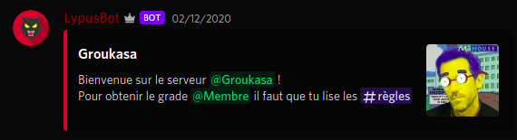
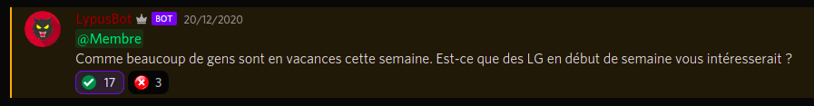
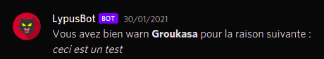
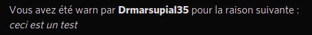

# Lypus-Bot

<p align="center">
  
</p>

LypusBot est un Bot Discord développé en Python à l'aide de la librairie [**Discord.py**](https://discordpy.readthedocs.io/en/latest/index.html)
et permettant de réaliser de nombreuses actions sur le serveur Discord de Lypus (serveur Minecraft communautaire de [Loup-Garou UHC](https://discord.gg/xECckR4AxH)).


## Fonctionnalités proposées

- Affectation automatique de rôles (A l'arrivé sur le serveur et lors de l'ajout de réaction sur un message)
- Création automatique de sondages
- Purge d'un salon (supprime les **n** derniers messages d'un salon et envoie une confirmation à la personne ayant lancé la commande) 
- Avertissement d'utilisateurs avec envoi automatique de message à la personne warn.
- Ajout de réactions à des messages

## Lancement

```shell
sh reload_bot.sh
```

Le bot n'est pas utilisable tel quel, vous devez modifier les identifiants de tous les rôles et salons. Il faut également ajouter le token de votre propre Bot et modifier l'emplacement du script Python dans le fichier *sh*

## Exemples

Liste des commandes disponibles par le Bot :
Exemple de message de bienvenue envoyé par le Bot lorsqu'un utilisateur rejoins le serveur :
<p align="center">
  
</p>

Exemple de sondage réalisé par le Bot :
<p align="center">
  
</p>

Exemple de messages reçu lorsqu'un modérateur met un avertissement à quelqu'un :
<p align="center">
  
</p>
<p align="center">
  
</p>